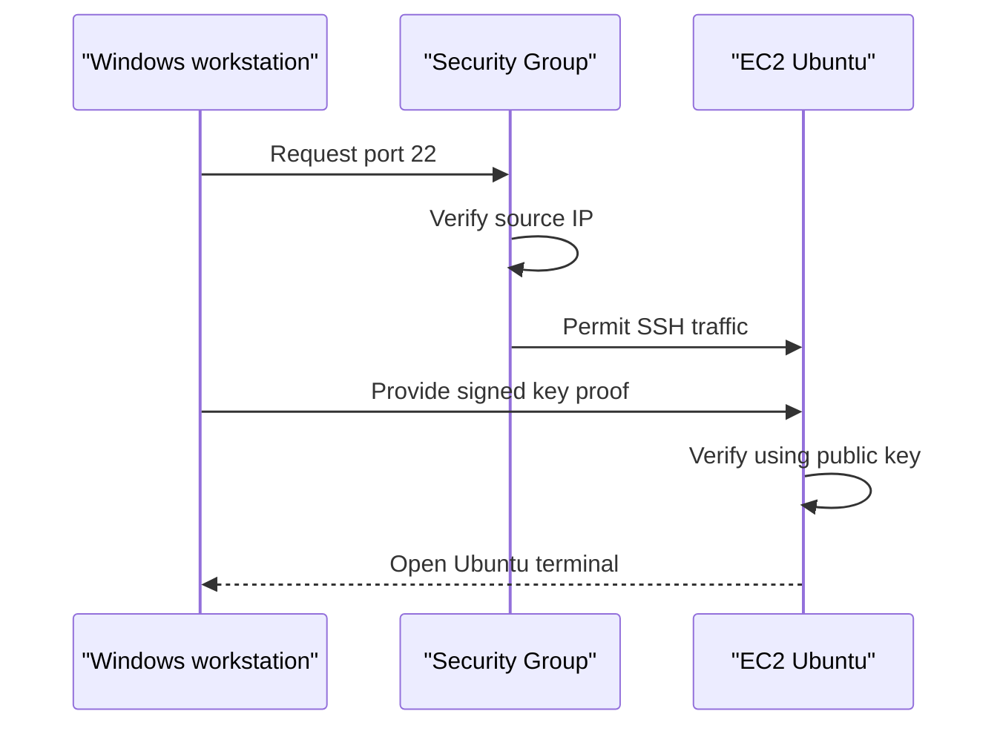
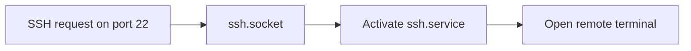

# Day 2 — EC2 and Linux Foundation

## Objective

Provision a real Ubuntu server on AWS, protect it with network and identity controls, connect through SSH, inspect its computing resources, update the operating system, and verify its background services.

The purpose of this session was to understand what exists underneath Docker and Kubernetes. Containers eventually run on a server, so we first need to understand the server itself.

---

## What Is an EC2 Instance?

Amazon EC2 provides virtual computers inside AWS data centers.

A physical AWS computer can be divided into multiple virtual computers. Each virtual computer behaves like an independent server with its own:

- Operating system
- CPU
- Memory
- Storage
- Network address
- Firewall rules
- Users and permissions

Our EC2 instance is the AWS computer that will eventually run the ReleaseGuard development environment.

---

## Architecture


### How the Components Connect

1. The Windows workstation acts as the SSH client.
2. The EC2 instance acts as the SSH server.
3. The public IPv4 address identifies the EC2 instance on the internet.
4. The Security Group decides whether the connection may reach port 22.
5. The private PEM key proves that the connecting user is authorized.
6. Ubuntu accepts the connection using the matching public key.
7. The EBS volume stores Ubuntu and server files.

---

## AWS Resources

| Component | Configuration | Why it was used |
|---|---|---|
| AWS Region | `us-east-1` | Determines the geographic AWS location |
| EC2 | Ubuntu virtual server | Provides computing capacity |
| Operating system | Ubuntu Server 24.04 LTS | Stable Linux distribution with long-term support |
| Architecture | x86_64 | Widely compatible with DevOps tools |
| Network | Default VPC | Provides an isolated AWS network |
| Subnet | Default public subnet | Allows the learning server to access the internet |
| Public IPv4 | Enabled | Allows the workstation to reach the server |
| Security Group | SSH from `My IP` | Restricts remote access |
| SSH port | TCP 22 | Standard encrypted remote-access port |
| Authentication | RSA key pair | Avoids password-based server login |
| CPU | 2 vCPUs | Executes operating-system and application instructions |
| Memory | Approximately 1 GiB | Temporary workspace for running programs |
| EBS volume | 8 GiB | Persistent storage for Ubuntu and files |

Resource IDs, account numbers, public IP addresses, access keys, and private-key contents are intentionally excluded from this repository.

---

## SSH Authentication

SSH stands for **Secure Shell**. It creates an encrypted remote terminal between a client and a server.



### Public and Private Keys

| Key | Storage location | Responsibility |
|---|---|---|
| Public key | AWS and the EC2 server | Verifies authentication proof |
| Private PEM key | Local workstation only | Creates authentication proof |

The private key is never uploaded to the server or committed to GitHub.

The server stores authorized public keys inside:

```text
/home/ubuntu/.ssh/authorized_keys
```

---

## Security Decisions

- Restricted SSH access to one trusted public IP using a `/32` rule.
- Used key-based authentication instead of password authentication.
- Stored the private PEM key outside the ReleaseGuard repository.
- Added `*.pem` and `*.key` patterns to `.gitignore`.
- Used the standard `ubuntu` account instead of directly using `root`.
- Used `sudo` only when administrator permission was required.
- Kept HTTP and HTTPS ports closed because no web application exists yet.
- Avoided storing AWS identifiers or IP addresses in project documentation.

---

# Commands Practiced

## Understanding the Terminal Prompt

The terminal prompt identifies which computer receives a command.

```text
PS C:\Users\...>
```

This means the command will run on the local Windows computer.

```text
ubuntu@ip-...:~$
```

This means the command will run on the remote Ubuntu EC2 server.

Running a Linux command at a PowerShell prompt will normally fail because Windows and Linux provide different commands.

---

## Windows PowerShell Commands

### 1. Validate the Private Key

```powershell
# Ask OpenSSH to read the private key and derive its public-key information.
# Send the generated output to $null because it does not need to be displayed.
ssh-keygen -y -f "<PRIVATE_KEY_PATH>.pem" > $null

# Display the exit code produced by ssh-keygen.
# Exit code 0 means the command succeeded.
$LASTEXITCODE
```

Why we used it:

- Verified that the PEM file was readable.
- Detected whether the private key had an invalid format.
- Confirmed that moving the file did not corrupt it.
- Avoided displaying generated public-key information.

### 2. Connect to the EC2 Server

```powershell
# Start an encrypted SSH connection.
# -i identifies the private key file.
# ubuntu is the operating-system username.
# EC2_PUBLIC_IP identifies the remote server.
ssh -i "<PRIVATE_KEY_PATH>.pem" ubuntu@<EC2_PUBLIC_IP>
```

Why we used it:

- Opened a remote Ubuntu terminal.
- Proved ownership of the corresponding private key.
- Allowed secure server administration without a password.

The real IP address and private-key path are not stored in this repository.

---

## Ubuntu Identity Commands

### 3. Identify the Current User

```bash
# Display the operating-system user executing commands.
whoami
```

Verified result:

```text
ubuntu
```

Why we used it:

- Confirmed that SSH authenticated successfully.
- Distinguished the Ubuntu user from the Windows and AWS IAM users.
- Verified that commands were not being executed directly as `root`.

---

## Ubuntu Filesystem Commands

### 4. List Visible Files

```bash
# List ordinary files and directories in the current location.
ls
```

Why we used it:

- Inspected the Ubuntu user’s home directory.
- Confirmed that a new home directory contains very few visible files.

### 5. List Detailed and Hidden Files

```bash
# -l displays detailed information.
# -a includes hidden files whose names begin with a period.
ls -la
```

Why we used it:

- Displayed Linux file permissions.
- Displayed file owners and groups.
- Revealed hidden files such as `.bashrc`, `.profile`, and `.ssh`.
- Introduced the Linux convention that names beginning with `.` are hidden.

### 6. Identify the Operating System

```bash
# Read and display Ubuntu's operating-system identification file.
cat /etc/os-release
```

Verified result:

```text
Ubuntu 24.04.4 LTS
```

Why we used it:

- Confirmed the Linux distribution and version.
- Verified that the system belongs to the Debian family.
- Determined that `apt` is the appropriate package manager.
- Prevented using commands intended for Red Hat or Amazon Linux.

---

## Hardware and Capacity Commands

### 7. Check CPU Capacity

```bash
# Display the number of processing units available to Ubuntu.
nproc
```

Verified result:

```text
2
```

Why we used it:

- Confirmed that Ubuntu can access two virtual CPUs.
- Established the server’s processing capacity.
- Prepared us to understand application CPU utilization later.

### 8. Check Memory

```bash
# Display RAM and swap usage.
# -h uses human-readable MiB and GiB units.
free -h
```

Verified result:

```text
Approximately 911 MiB total memory
Approximately 547 MiB initially available
No swap configured
```

Why we used it:

- Measured the server’s temporary working memory.
- Distinguished total, used, free, cached, and available memory.
- Identified that the current server is suitable for basic learning but will need more RAM before running the complete Kubernetes and monitoring stack.
- Introduced the possibility of `OOMKilled` errors when applications exceed available memory.

### 9. Inspect Disks and Partitions

```bash
# List block-storage devices, partitions, sizes, and mount points.
lsblk
```

Verified structure:

```text
8 GiB EBS disk
Root partition mounted at /
Separate boot and EFI partitions
```

Why we used it:

- Distinguished the complete EBS disk from its partitions.
- Identified where the Ubuntu root filesystem is mounted.
- Confirmed the actual disk capacity instead of assuming the console configuration was correct.

### 10. Check Root-Filesystem Usage

```bash
# Display storage usage for the root filesystem.
# -h uses human-readable units.
df -h /
```

Verified result before package upgrades:

```text
Root filesystem: approximately 6.8 GiB
Available storage: approximately 4.8 GiB
Usage: approximately 30%
```

Why we used it:

- Checked whether sufficient disk space existed for updates.
- Established a storage baseline.
- Introduced capacity monitoring before software installation.

---

## Package-Management Commands

### 11. Refresh the Package Catalog

```bash
# Temporarily use administrator privileges.
# Ask Ubuntu's apt package manager to refresh available package information.
sudo apt update
```

Why we used it:

- Downloaded current package metadata from Ubuntu repositories.
- Checked Ubuntu’s official security repository.
- Found newer versions of installed packages.
- Refreshed information without installing upgrades.

Important difference:

| Command | Action |
|---|---|
| `apt update` | Refreshes the available-software catalog |
| `apt upgrade` | Installs newer versions of existing packages |

### 12. Install Available Upgrades

```bash
# Install newer versions of existing packages.
# -y automatically confirms the installation prompt.
sudo apt upgrade -y
```

Why we used it:

- Applied operating-system and security updates.
- Updated system libraries before installing project tools.
- Installed an updated AWS-optimized Linux kernel.
- Created a cleaner and more predictable software foundation.

In production, upgrades should be tested before broad deployment. Automatic confirmation is acceptable here because this is a new development server without a running application.

---

## Reboot and Kernel Commands

### 13. Reboot Ubuntu

```bash
# Restart the operating system.
sudo reboot
```

Why we used it:

- Loaded the newly installed Linux kernel.
- Restarted services that were using older libraries.
- Demonstrated that rebooting disconnects SSH.
- Confirmed that rebooting does not terminate the EC2 instance.

Expected SSH behavior:

```text
client_loop: send disconnect: Connection reset
```

This message was expected because Ubuntu closed the network connection during reboot.

### 14. Verify the Running Kernel

```bash
# Display the active Linux kernel release.
uname -r
```

Verified result:

```text
7.0.0-1012-aws
```

Why we used it:

- Confirmed that the reboot loaded the new kernel.
- Practiced verifying a change rather than assuming it succeeded.
- Identified the AWS-optimized kernel currently controlling the virtual hardware.

---

## Linux Service Commands

Linux uses `systemd` to manage background services. The `systemctl` command communicates with `systemd`.

### 15. Check Whether SSH Is Running

```bash
# Ask systemd whether the SSH service is currently running.
systemctl is-active ssh
```

Verified result:

```text
active
```

Why we used it:

- Confirmed that the SSH service was running.
- Verified that a background program was available to handle remote sessions.

### 16. Check Whether SSH Service Starts Directly

```bash
# Check whether ssh.service is configured to start directly during boot.
systemctl is-enabled ssh
```

Verified result:

```text
disabled
```

Why this was not a failure:

- Ubuntu can use socket activation for SSH.
- The SSH service does not need to start permanently during every boot.
- `ssh.socket` can listen for connections and activate the service when required.

### 17. Check SSH Socket Startup

```bash
# Verify that the SSH socket is configured to start automatically.
systemctl is-enabled ssh.socket
```

Verified result:

```text
enabled
```

Why we used it:

- Confirmed how Ubuntu makes SSH available after reboot.
- Explained why `ssh.service` could be disabled while remote access still worked.

### 18. Check Whether the SSH Socket Is Active

```bash
# Verify that the SSH socket is currently listening for connections.
systemctl is-active ssh.socket
```

Verified result:

```text
active
```

Why we used it:

- Confirmed that Ubuntu was ready to receive SSH requests.
- Verified the complete socket-activation configuration.



---

## Session Command

### 19. Close the SSH Session

```bash
# End the current remote session and return to the local terminal.
exit
```

Why we use it:

- Closes the encrypted SSH connection.
- Returns control to Windows PowerShell.
- Does not stop, reboot, or terminate EC2.

---

# Troubleshooting Performed

## Problem 1: Invalid Private-Key Format

The original private key produced an invalid-format error.

Actions taken:

1. Checked the PEM file location and size.
2. Avoided exposing the private-key contents.
3. Verified that the original EC2 instance used a different key pair.
4. Deleted the empty instance because it contained no project data.
5. Removed the unusable local PEM file.

## Problem 2: EC2 Key-Pair Mismatch

The first EC2 instance expected a different key pair from the private key being presented.

The replacement process:

1. Created a uniquely named RSA key pair.
2. Downloaded the PEM file once.
3. Stored it outside the Git repository.
4. Validated it with `ssh-keygen`.
5. Selected the matching key pair while launching EC2.
6. Confirmed the key-pair assignment in the EC2 details.
7. Successfully authenticated using OpenSSH.

## Problem 3: Linux Command Executed in PowerShell

After rebooting, the SSH session disconnected and returned to PowerShell. The Linux command `uname` was accidentally executed locally.

Lesson learned:

- Always inspect the terminal prompt.
- Reconnect through SSH before executing Linux commands.
- The same terminal window can control different computers at different times.

## Problem 4: SSH Service Reported Disabled

`ssh.service` was active but reported as disabled for automatic startup.

Investigation showed:

```text
ssh.service: active
ssh.service: disabled
ssh.socket: active
ssh.socket: enabled
```

Conclusion:

Ubuntu uses socket activation. The enabled socket listens for incoming connections and starts the SSH service when required. No configuration change was necessary.

---

# Key Concepts Learned

## CPU, RAM, and Storage Are Different

| Resource | Simple analogy | Responsibility |
|---|---|---|
| CPU | Cook | Performs work |
| RAM | Kitchen counter | Holds information currently being used |
| Disk | Storage room | Keeps files long-term |

The EC2 instance type controls CPU and RAM. The EBS volume controls persistent storage.

## Active and Enabled Are Different

| State | Meaning |
|---|---|
| Active | Service is running now |
| Enabled | Service or socket is configured for future boots |

## IAM User and Ubuntu User Are Different

| User | Responsibility |
|---|---|
| AWS IAM user | Controls permission to manage AWS resources |
| Ubuntu user | Controls commands and files inside EC2 |

## Public and Private IP Addresses Are Different

- A public IP allows communication over the internet.
- A private IP identifies the instance inside the AWS VPC.
- Public and private IP addresses should be omitted from public documentation when they are unnecessary.

---

# Verification Summary

| Verification | Result |
|---|---|
| SSH authentication | Passed |
| Ubuntu user | `ubuntu` |
| Operating system | Ubuntu 24.04.4 LTS |
| Updated kernel | `7.0.0-1012-aws` |
| CPU | 2 vCPUs |
| Memory | Approximately 1 GiB |
| EBS storage | 8 GiB |
| Package update | Completed |
| Package upgrade | Completed |
| Reboot test | Passed |
| SSH service | Active |
| SSH socket | Active and enabled |

---

# Operational Lessons

- Verify configurations using commands instead of relying only on the console.
- Never commit private keys or credentials.
- Restrict SSH to known IP addresses.
- Run administrator commands through `sudo`.
- Check CPU, memory, and disk space before installing workloads.
- Understand whether a command is running locally or remotely.
- Reconnect after a server reboot.
- Verify a new kernel after installing system updates.
- Investigate unexpected service states before changing configuration.
- Document failures and solutions because troubleshooting is part of DevOps work.

---

# Next Step

Day 3 will introduce processes and containers from zero. It will explain why containers were created, how Docker packages an application, how files connect during a Docker build, and how to run the first ReleaseGuard application component.